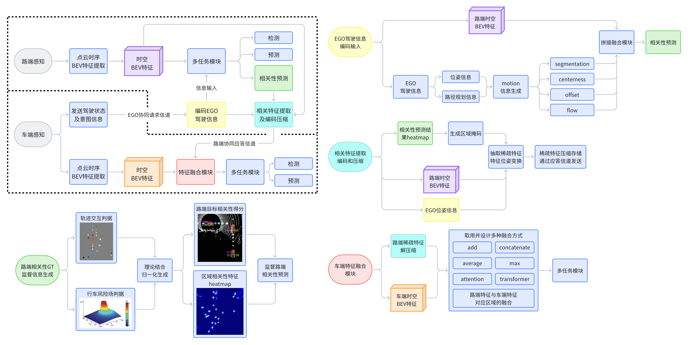

## Description

### **基于交互风险与意图引导的车路协同感知**



## TODO

- [] 修改`FIXME`内容

## Structure

**工程文件夹：`projects/MyProject`**

**配置文件：`projects/MyProject/configs/exp1.py`**

`configs`是develop的原生配置，**将会在打包的时候放置在`mmdet3d/.mim`下以供`mim`来使用**

`data`是存放所有的数据集、数据标签、临时数据、权重数据、中间数据的地方

`demo`是develop的示例代码，有一些数据样本和数据处理、推理的代码，**将会在打包的时候放置在`mmdet3d/.mim`下以供`mim`程序来使用**

`mmdet3d`作为项目的主体文件，**注意并不是作为第三方库使用，而是作为开发库使用，详情可以见`setup.py`文件**

`projects`是每个模型自带的特殊文件，存放每个模型的配置、自定义操作、自定义信息等代码，内部结构可以自定义

`tools`是develop的工具代码，涵盖数据处理、训练测试的总代码，**将会在打包的时候放置在`mmdet3d/.mim`下以供`mim`来使用**

## Get Started

`pip install -r requirements.txt`

Choose one of the two methods below:

```Bash
git clone https://github.com/klintan/pypcd.git
cd pypcd
python setup.py install
```

```Bash
cd thirdpart
unzip ./*
cd pypcd
python setup.py install
```

基于`mmdet3d v1.3.0`，环境要求位于`requirements.txt`中。

**注意，如果系统环境中同时存在多个版本的`mmdet3d`，注意在使用前于项目根目录运行 `pip install -e .`**

## Command

```Bash
# debug
python tools/train_v2x.py projects/MyProject/configs/exp_new_1.py

# train without checkpoint (DDP mode recommended)
nohup python -m torch.distributed.launch --nproc_per_node=1 tools/train_v2x.py projects/MyProject/configs/exp1.py --launcher pytorch &

# train with checkpoint (DDP mode recommended)
nohup python -m torch.distributed.launch --nproc_per_node=1 tools/train_v2x.py projects/MyProject/configs/exp1.py --launcher pytorch --checkpoint /ai/volume/work/work_dirs/exp1/single_epoch_20.pth &

# test a checkpoint (Please modify the config file first)
python tools/test_v2x.py projects/MyProject/configs/exp1.py work_dirs/exp1/epoch_20.pth --work-dir work_dirs/uni_temppp

#create data
# deepaccident no sweeps
python tools/create_data.py deepaccident --root-path /path/to/dataset --sample-interval 5 --out-dir ./data/deepaccident
# deepaccident multi sweeps (max-sweeps must lt sample-interval)
python tools/create_data.py deepaccident --root-path /path/to/dataset --sample-interval 5 --out-dir ./data/deepaccident_ms --max-sweeps 2
# deepaccident 10 small amounts of data (no sweeps)
python tools/create_data.py deepaccident --root-path /path/to/dataset --sample-interval 5 --out-dir ./data/deepaccident_debug --debug
# deepaccident 10 small amounts of data (with sweeps)
python tools/create_data.py deepaccident --root-path /path/to/dataset --sample-interval 5 --out-dir ./data/deepaccident_ms_debug --max-sweeps 2 --debug

# deepaccident 文件结构：
# .
# ├── DeepAccident_mini
# │   ├── ......
# ├── split_txt_files
# │   ├── test.txt
# │   ├── train.txt
# │   └── val.txt
# ├── type1_subtype1_accident
# │   ├── ego_vehicle
# │   ├── ego_vehicle_behind
# │   ├── infrastructure
# │   ├── meta
# │   ├── other_vehicle
# │   └── other_vehicle_behind
# ├── type1_subtype1_normal
# │   ├── ......
# ├── type1_subtype2_accident
# │   ├── ......
# └── type1_subtype2_normal
#     ├── ......

# analyze data
python tools/analyze_data.py /path/to/config --mode check_raw_info_format --verbose

# generate env info
pipreqs --ignore ./thirdpart/ --savepath ./current_env.txt --use-local ./

```